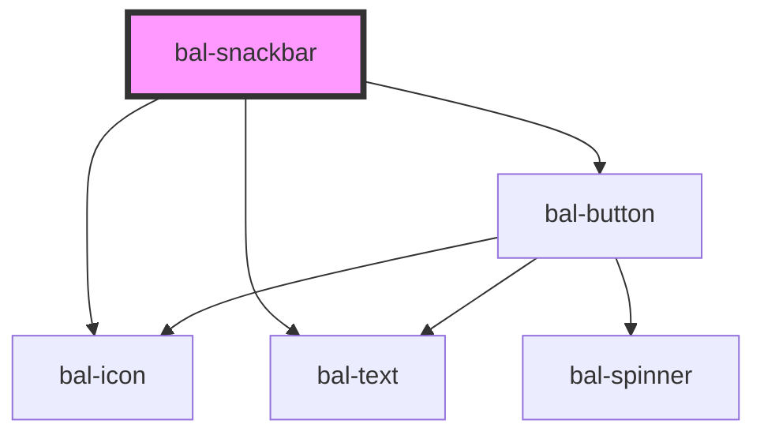

# bal-toast

Toast are used to inform the user with a simple text message.

> Note: Toast are getting queued to not confuse the users.

## Usage

Toast can be created with the `balToastController`. The default duration is 5000 milliseconds.

```typescript
import { balToastController } from '@baloise/ui-library'

balToastController.create({ message: 'Hi I am a default Toast!', duration: 1000 })
balToastController.create({ message: 'Warning!', type: 'is-warning' })
balToastController.create({ message: 'Danger zone!', type: 'is-danger' })
```

<!-- Auto Generated Below -->


## Properties

| Property   | Attribute  | Description                                                       | Type                                                              | Default     |
| ---------- | ---------- | ----------------------------------------------------------------- | ----------------------------------------------------------------- | ----------- |
| `duration` | `duration` | The duration of the snackbar                                      | `number`                                                          | `0`         |
| `icon`     | `icon`     | The icon of the snackbar header                                   | `string`                                                          | `undefined` |
| `message`  | `message`  | The message of the snackbar                                       | `string`                                                          | `undefined` |
| `subject`  | `subject`  | The subject of the snackbar header                                | `string`                                                          | `undefined` |
| `type`     | `type`     | The theme type of the snackbar. Given by bulma our css framework. | `"" \| "danger" \| "info" \| "primary" \| "success" \| "warning"` | `''`        |


## Events

| Event      | Description                     | Type                  |
| ---------- | ------------------------------- | --------------------- |
| `balClose` | Emitted when snackbar is closed | `CustomEvent<string>` |


## Methods

### `close() => Promise<void>`

Closes this snackbar

#### Returns

Type: `Promise<void>`


### `closeIn(duration: number) => Promise<void>`

Closes the snackbar after the given duration in ms

#### Returns

Type: `Promise<void>`


## Dependencies

### Depends on

- [bal-icon](../bal-icon)
- [bal-text](../bal-text)
- [bal-button](../bal-button)

### Graph


----------------------------------------------

*Built with [StencilJS](https://stenciljs.com/)*
