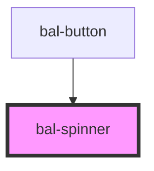

# bal-spinner

A spinner is a animated graphic that lets the user know content is being loaded.

<!-- Auto Generated Below -->

## Properties

| Property   | Attribute  | Description                                            | Type      | Default |
| ---------- | ---------- | ------------------------------------------------------ | --------- | ------- |
| `inverted` | `inverted` | If `true` the component can be used on dark background | `boolean` | `false` |
| `small`    | `small`    | If `true` the component is smaller                     | `boolean` | `false` |

## Dependencies

### Used by

 - [bal-button](../bal-button)

### Graph

----------------------------------------------

*Built with [StencilJS](https://stenciljs.com/)*
