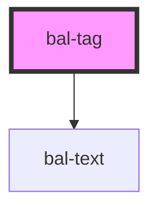

# bal-tag

A simple tag in different colors

<!-- Auto Generated Below -->

## Properties

| Property | Attribute | Description                                                  | Type                                                                             | Default |
| -------- | --------- | ------------------------------------------------------------ | -------------------------------------------------------------------------------- | ------- |
| `type`   | `type`    | The theme type of the tag. Given by bulma our css framework. | `"" \| "is-danger" \| "is-info" \| "is-primary" \| "is-success" \| "is-warning"` | `''`    |

## Dependencies

### Depends on

- [bal-text](../bal-text)

### Graph

----------------------------------------------

*Built with [StencilJS](https://stenciljs.com/)*
