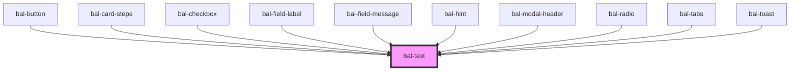

# bal-text

<!-- Auto Generated Below -->

## Dependencies

### Used by

 - [bal-button](../bal-button)
 - [bal-card-steps](../bal-card-steps)
 - [bal-checkbox](../bal-checkbox)
 - [bal-field-label](../bal-field-label)
 - [bal-field-message](../bal-field-message)
 - [bal-hint](../bal-hint)
 - [bal-modal-header](../bal-modal-header)
 - [bal-radio](../bal-radio)
 - [bal-tabs](../bal-tabs)
 - [bal-toast](../bal-toast)

### Graph

----------------------------------------------

*Built with [StencilJS](https://stenciljs.com/)*
