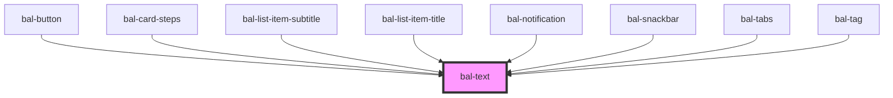

# bal-text

A text provides some additional helpers.

<!-- Auto Generated Below -->

## Properties

| Property | Attribute | Description                                                    | Type                                                              | Default |
| -------- | --------- | -------------------------------------------------------------- | ----------------------------------------------------------------- | ------- |
| `color`  | `color`   | The theme type of the toast. Given by bulma our css framework. | `"" \| "danger" \| "info" \| "primary" \| "success" \| "warning"` | `''`    |
| `small`  | `small`   | If `true` the text has a small size                            | `boolean`                                                         | `false` |

## Dependencies

### Used by

 - [bal-button](../bal-button)
 - [bal-card-steps](../bal-card-steps)
 - [bal-list-item-subtitle](../bal-list-item-subtitle)
 - [bal-list-item-title](../bal-list-item-title)
 - [bal-notification](../bal-notification)
 - [bal-snackbar](../bal-snackbar)
 - [bal-tabs](../bal-tabs)
 - [bal-tag](../bal-tag)

### Graph

----------------------------------------------

*Built with [StencilJS](https://stenciljs.com/)*
