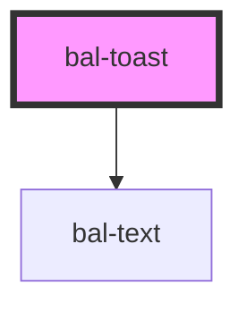

# bal-toast

Toast are used to inform the user with a simple text message.

> Note: Toast are getting queued to not confuse the users.

## Usage

Toast can be created with the `balToastController`. The default duration is 5000 milliseconds.

```typescript
import { balToastController } from '@baloise/ui-library'

balToastController.create({ message: 'Hi I am a default Toast!', duration: 1000 })
balToastController.create({ message: 'Warning!', type: 'is-warning' })
balToastController.create({ message: 'Danger zone!', type: 'is-danger' })
```

<!-- Auto Generated Below -->


## Properties

| Property | Attribute | Description                                                    | Type                                                                       | Default        |
| -------- | --------- | -------------------------------------------------------------- | -------------------------------------------------------------------------- | -------------- |
| `type`   | `type`    | The theme type of the toast. Given by bulma our css framework. | `"is-danger" \| "is-info" \| "is-primary" \| "is-success" \| "is-warning"` | `'is-primary'` |


## Methods

### `close() => Promise<void>`

Closes this toast

#### Returns

Type: `Promise<void>`


### `closeIn(duration: number) => Promise<void>`

Closes the toast after the given duration in ms

#### Returns

Type: `Promise<void>`


## Dependencies

### Depends on

- [bal-text](../bal-text)

### Graph


----------------------------------------------

*Built with [StencilJS](https://stenciljs.com/)*
