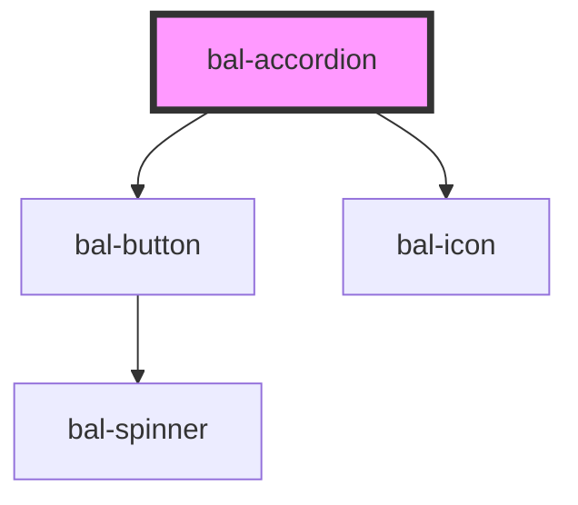

# Accordion

Accordion is a easy way to toggle things.

## Basic

```html
<bal-accordion class="box" open-label="Details einblenden" close-label="Details ausblenden">
    <p class="is-padded">Lorem ipsum dolor sit amet, consectetur adipiscing elit, sed do eiusmod tempor incididunt ut labore et dolore magna aliqua.</p>
</bal-accordion>
```

## Types

The accordion has 2 type of themes `is-info` and `is-primary`.

```html
<bal-accordion class="box" type="is-info" open-label="Details einblenden" close-label="Details ausblenden">
    <p class="is-padded">Lorem ipsum dolor sit amet, consectetur adipiscing elit, sed do eiusmod tempor incididunt ut labore et dolore magna aliqua.</p>
</bal-accordion>
```

## Open accordion

```html
<bal-accordion class="box" collapsed="false" open-label="Details einblenden" close-label="Details ausblenden">
    <p class="is-padded">Lorem ipsum dolor sit amet, consectetur adipiscing elit, sed do eiusmod tempor incididunt ut labore et dolore magna aliqua.</p>
</bal-accordion>
```

## Trigger label & icon

Use the properties `open-label` & `open-icon` to change the content of the trigger button.

```html
<bal-accordion class="box" 
                open-icon="edit" 
                open-label="Bearbeiten" 
                close-label="Schliessen"
                close-icon="close-big">
    <p class="is-padded">Lorem ipsum dolor sit amet, consectetur adipiscing elit, sed do eiusmod tempor incididunt ut labore et dolore magna aliqua.</p>
</bal-accordion>
```

<!-- Auto Generated Below -->


## Properties

| Property     | Attribute     | Description                                    | Type                        | Default        |
| ------------ | ------------- | ---------------------------------------------- | --------------------------- | -------------- |
| `closeIcon`  | `close-icon`  | Bal-Icon of the close trigger button           | `string`                    | `"minus"`      |
| `closeLabel` | `close-label` | Label of the close trigger button              | `string`                    | `""`           |
| `collapsed`  | `collapsed`   | Controls if the accordion is collapsed or not  | `boolean`                   | `true`         |
| `openIcon`   | `open-icon`   | Bal-Icon of the open trigger button            | `string`                    | `"plus"`       |
| `openLabel`  | `open-label`  | Label of the open trigger button               | `string`                    | `""`           |
| `type`       | `type`        | Type defines the theme of the accordion toggle | `"is-info" \| "is-primary"` | `"is-primary"` |


## Methods

### `close() => Promise<void>`

Close the accordion

#### Returns

Type: `Promise<void>`


### `open() => Promise<void>`

Open the accordion

#### Returns

Type: `Promise<void>`


### `toggle() => Promise<void>`

Triggers the accordion

#### Returns

Type: `Promise<void>`


## Dependencies

### Depends on

- [bal-button](../button)
- [bal-icon](../icon)

### Graph


----------------------------------------------

*Built with [StencilJS](https://stenciljs.com/)*
