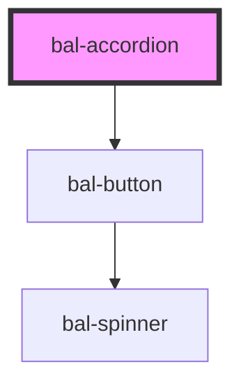

# bal-accordion

```html
<div class="box">
  <bal-accordion>Frohe Festtage</bal-accordion>
</div>
<bal-accordion collapsed="false">Frohe Festtage</bal-accordion>
```

```html
<div class="box">
  <bal-accordion type="is-info">Frohe Festtage</bal-accordion>
</div>
```

<!-- Auto Generated Below -->


## Properties

| Property    | Attribute   | Description                                   | Type                        | Default        |
| ----------- | ----------- | --------------------------------------------- | --------------------------- | -------------- |
| `collapsed` | `collapsed` | Controls if the accordion is collapsed or not | `boolean`                   | `true`         |
| `type`      | `type`      |                                               | `"is-info" \| "is-primary"` | `"is-primary"` |


## Dependencies

### Depends on

- [bal-button](../bal-button)

### Graph


----------------------------------------------

*Built with [StencilJS](https://stenciljs.com/)*
