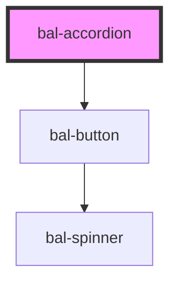

# Accordion

Accordion is a easy way to toggle things.

## Basic

```html
<bal-accordion class="box">
    <p class="is-padded">Lorem ipsum dolor sit amet, consectetur adipiscing elit, sed do eiusmod tempor incididunt ut labore et dolore magna aliqua.</p>
</bal-accordion>
```

## Types

The accordion has 2 type of themes `is-info` and `is-primary`.

```html
<bal-accordion class="box" type="is-info">
    <p class="is-padded">Lorem ipsum dolor sit amet, consectetur adipiscing elit, sed do eiusmod tempor incididunt ut labore et dolore magna aliqua.</p>
</bal-accordion>
```

## Open accordion

```html
<bal-accordion class="box" collapsed="false">
    <p class="is-padded">Lorem ipsum dolor sit amet, consectetur adipiscing elit, sed do eiusmod tempor incididunt ut labore et dolore magna aliqua.</p>
</bal-accordion>
```

## Trigger label

Use the `trigger` slot to define the label of the trigger

```html
<bal-accordion class="box">
    <span slot="trigger-open" class="accordion-trigger">
        <span class="icon">
            <i class="bal-icon-plus"></i>
        </span>
        <span>Open</span>
    </span>
    <span slot="trigger-close" class="accordion-trigger">
        <span class="icon">
            <i class="bal-icon-minus"></i>
        </span>
        <span>Close</span>
    </span>
    <p class="is-padded">Lorem ipsum dolor sit amet, consectetur adipiscing elit, sed do eiusmod tempor incididunt ut labore et dolore magna aliqua.</p>
</bal-accordion>
```


<!-- Auto Generated Below -->


## Properties

| Property    | Attribute   | Description                                    | Type                        | Default        |
| ----------- | ----------- | ---------------------------------------------- | --------------------------- | -------------- |
| `collapsed` | `collapsed` | Controls if the accordion is collapsed or not  | `boolean`                   | `true`         |
| `type`      | `type`      | Type defines the theme of the accordion toggle | `"is-info" \| "is-primary"` | `"is-primary"` |


## Methods

### `close() => Promise<void>`

Close the accordion

#### Returns

Type: `Promise<void>`


### `open() => Promise<void>`

Open the accordion

#### Returns

Type: `Promise<void>`


### `toggle() => Promise<void>`

Triggers the accordion

#### Returns

Type: `Promise<void>`


## Dependencies

### Depends on

- [bal-button](../bal-button)

### Graph


----------------------------------------------

*Built with [StencilJS](https://stenciljs.com/)*
