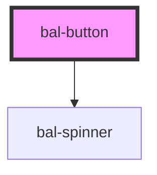

# Button

The classic button, in different colors, sizes, and states

## Basics

```html
<bal-button type="is-primary">Primary</bal-button>
<bal-button type="is-info">Info</bal-button>
<bal-button type="is-success">Success</bal-button>
<bal-button type="is-warning">Warning</bal-button>
<bal-button type="is-danger">Danger</bal-button>
<bal-button type="is-link">Link</bal-button>
```

## Outlined

```html
<bal-button type="is-primary is-outlined">Primary</bal-button>
<bal-button type="is-info is-outlined">Info</bal-button>
<bal-button type="is-success is-outlined">Success</bal-button>
<bal-button type="is-warning is-outlined">Warnung</bal-button>
<bal-button type="is-danger is-outlined">Danger</bal-button>
```

## Inverted

```html
<div class="has-inverted-background">
  <bal-button type="is-primary is-inverted">Primary</bal-button>
  <bal-button type="is-info is-inverted">Info</bal-button>
  <bal-button type="is-info is-inverted is-outlined">Info Outlined</bal-button>
</div>
```

## Disabled

```html
<bal-button type="is-primary" disabled>Primary</bal-button>
<bal-button type="is-info" disabled>Info</bal-button>
<bal-button type="is-success" disabled>Success</bal-button>
<bal-button type="is-warning" disabled>Warning</bal-button>
<bal-button type="is-danger" disabled>Danger</bal-button>
<bal-button type="is-link" disabled>Link</bal-button>
```

## Loading

```html
<bal-button type="is-primary" loading>Primary</bal-button>
<bal-button type="is-info" loading>Info</bal-button>
<bal-button type="is-success" loading>Success</bal-button>
<bal-button type="is-warning" loading>Warning</bal-button>
<bal-button type="is-danger" loading>Danger</bal-button>
```

<!-- Auto Generated Below -->


## Properties

| Property   | Attribute  | Description                                                           | Type                                                                                    | Default        |
| ---------- | ---------- | --------------------------------------------------------------------- | --------------------------------------------------------------------------------------- | -------------- |
| `disabled` | `disabled` | If `true` the button is disabled                                      | `boolean`                                                                               | `undefined`    |
| `loading`  | `loading`  | If `true` the label is hidden and a loading spinner is shown instead. | `boolean`                                                                               | `undefined`    |
| `type`     | `type`     | The theme type of the button. Given by bulma our css framework.       | `"is-danger" \| "is-info" \| "is-link" \| "is-primary" \| "is-success" \| "is-warning"` | `"is-primary"` |


## Dependencies

### Depends on

- [bal-spinner](../bal-spinner)

### Graph


----------------------------------------------

*Built with [StencilJS](https://stenciljs.com/)*
