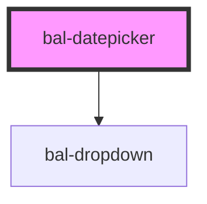

# Datepicker

An input with a simple dropdown for selecting a date.

## Basic

```html
<bal-datepicker></bal-datepicker>
```

## Set Date

```html
<bal-datepicker value="20.02.2020"></bal-datepicker>
```

## Date Range

You can limit the date range with min-date and max-date props.

```html
<bal-datepicker min-date="10.02.2020" max-date="22.02.2020" value="20.02.2020"></bal-datepicker>
```

## Disabled

```html
<bal-datepicker disabled value="20.02.2020"></bal-datepicker>
```

## Translations


### Italian

You can change the language with the language prop.

```html
<bal-datepicker language="it" value="20.02.2020"></bal-datepicker>
```

<!-- Auto Generated Below -->


## Properties

| Property   | Attribute  | Description                                                              | Type      | Default |
| ---------- | ---------- | ------------------------------------------------------------------------ | --------- | ------- |
| `disabled` | `disabled` | Disable the input                                                        | `boolean` | `false` |
| `language` | `language` | Language of the datepicker. Possible values are `de`, `fr`,`it` or `en`. | `string`  | `"de"`  |
| `maxDate`  | `max-date` | Latest date available for selection                                      | `string`  | `""`    |
| `minDate`  | `min-date` | Earliest date available for selection                                    | `string`  | `""`    |
| `value`    | `value`    | The value of the datepicker with the format `dd.MM.yyyy`.                | `string`  | `""`    |


## Events

| Event   | Description                                          | Type                  |
| ------- | ---------------------------------------------------- | --------------------- |
| `input` | Triggers when the value of the datepicker is changed | `CustomEvent<string>` |


## Methods

### `close() => Promise<void>`

Close the datepicker dropdown

#### Returns

Type: `Promise<void>`


### `open() => Promise<void>`

Open the datepicker dropdown

#### Returns

Type: `Promise<void>`


## Dependencies

### Depends on

- [bal-dropdown](../bal-dropdown)

### Graph


----------------------------------------------

*Built with [StencilJS](https://stenciljs.com/)*
