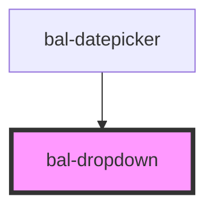

# Dropdown

A basic dropdown.

## Basic

```html
<bal-dropdown>
    <bal-dropdown-item value="1">Label One</bal-dropdown-item>
    <bal-dropdown-item value="2">Label Two</bal-dropdown-item>
    <bal-dropdown-item value="3">Label Three</bal-dropdown-item>
</bal-dropdown>
```

## Set Value

```html
<bal-dropdown value="2">
    <bal-dropdown-item value="1">Label One</bal-dropdown-item>
    <bal-dropdown-item value="2">Label Two</bal-dropdown-item>
    <bal-dropdown-item value="3">Label Three</bal-dropdown-item>
</bal-dropdown>
```

## Custom

```html
<bal-dropdown>
    <bal-dropdown-item value="1">Label <strong>One</strong></bal-dropdown-item>
    <bal-dropdown-item value="2">Label <strong>Two</strong></bal-dropdown-item>
    <bal-dropdown-item value="3">Label <strong>Three</strong></bal-dropdown-item>
</bal-dropdown>
```


<!-- Auto Generated Below -->


## Properties

| Property         | Attribute          | Description                                       | Type      | Default |
| ---------------- | ------------------ | ------------------------------------------------- | --------- | ------- |
| `expanded`       | `expanded`         | If `true` the field expands over the whole width. | `boolean` | `false` |
| `showBottomLine` | `show-bottom-line` | If `true` the field gets a line below.            | `boolean` | `true`  |
| `value`          | `value`            | The value of the selected dropdown item.          | `any`     | `null`  |


## Events

| Event                | Description | Type               |
| -------------------- | ----------- | ------------------ |
| `dropdownSelected`   |             | `CustomEvent<any>` |
| `selectDropdownItem` |             | `CustomEvent<any>` |


## Methods

### `close() => Promise<void>`

Closes the dropdown menu

#### Returns

Type: `Promise<void>`


### `getSelectedValue() => Promise<any>`

Returns the value of the dropdown.

#### Returns

Type: `Promise<any>`


### `open() => Promise<void>`

Open the dropdown menu

#### Returns

Type: `Promise<void>`


### `selectItem(option: DropDownOption) => Promise<void>`

Selects a dropdown item and changes the value.

#### Returns

Type: `Promise<void>`


### `toggle() => Promise<void>`

Open & closes the dropdown

#### Returns

Type: `Promise<void>`


## Dependencies

### Used by

 - [bal-datepicker](../bal-datepicker)

### Graph


----------------------------------------------

*Built with [StencilJS](https://stenciljs.com/)*
