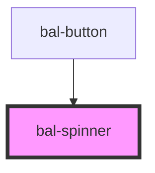

# Spinner

A simple loading spinner.

## Basic

```html
<bal-spinner></bal-spinner>
```

## Small

```html
<bal-spinner class="is-small"></bal-spinner>
```

## Inverted

```html
<div class="has-background-info is-padded">
  <bal-spinner class="is-inverted"></bal-spinner>
</div>
```

<!-- Auto Generated Below -->


## Dependencies

### Used by

 - [bal-button](../bal-button)

### Graph


----------------------------------------------

*Built with [StencilJS](https://stenciljs.com/)*
