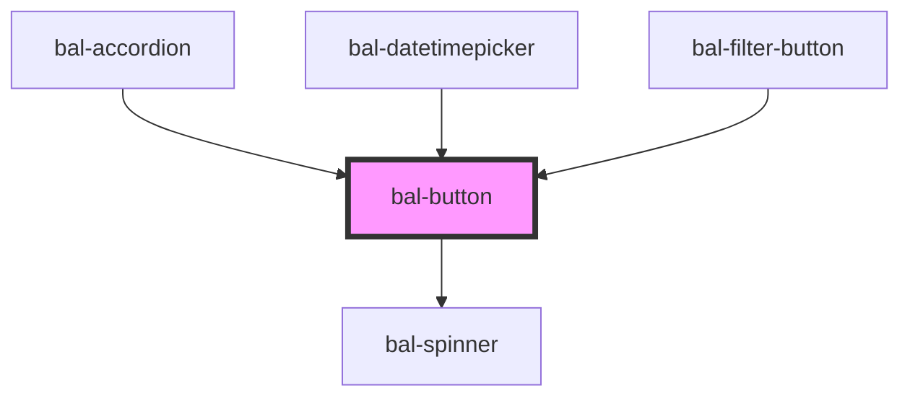

# Button

The classic button, in different colors, sizes, and states

## Usage

```html
<bal-button type="is-primary">Primary</bal-button>
<bal-button type="is-info">Info</bal-button>
<bal-button type="is-link">Link</bal-button>
```

### Outlined

```html
<bal-button type="is-info" outlined>Info</bal-button>
```

### Inverted

```html
<div class="has-inverted-background">
  <bal-button type="is-primary" inverted>Primary</bal-button>
  <bal-button type="is-info" inverted>Info</bal-button>
  <bal-button type="is-info" inverted outlined>Info Outlined</bal-button>
</div>
```

### Disabled

```html
<bal-button type="is-primary" disabled>Primary</bal-button>
<bal-button type="is-info" disabled>Info</bal-button>
<bal-button type="is-link" disabled>Link</bal-button>
```

### Loading

```html
<bal-button type="is-primary" loading>Primary</bal-button>
<bal-button type="is-info" loading>Info</bal-button>
```

### Expanded

```html
<bal-button type="is-primary" expanded>Primary</bal-button>
<br>
<bal-button type="is-info" expanded>Info</bal-button>
```

### Small buttons

```html
<bal-button type="is-primary" size="is-small">
    Primary
</bal-button>
<bal-button type="is-info" size="is-small">
    Info
</bal-button>
```

```html
<bal-button type="is-info" size="is-small" is-square outlined>
    <bal-icon name="edit" size="medium"></bal-icon>
</bal-button>
<bal-button type="is-info" size="is-small" is-square outlined>
    <bal-icon name="trash" size="medium"></bal-icon>
</bal-button>
```

<!-- Auto Generated Below -->


## Properties

| Property   | Attribute   | Description                                                           | Type                                                                                    | Default        |
| ---------- | ----------- | --------------------------------------------------------------------- | --------------------------------------------------------------------------------------- | -------------- |
| `dense`    | `dense`     | If `true` the button is dense                                         | `boolean`                                                                               | `undefined`    |
| `disabled` | `disabled`  | If `true` the button is disabled                                      | `boolean`                                                                               | `undefined`    |
| `expanded` | `expanded`  | If `true` the button has a full width                                 | `boolean`                                                                               | `undefined`    |
| `inverted` | `inverted`  | If `true` the button is inverted                                      | `boolean`                                                                               | `undefined`    |
| `isActive` | `is-active` | If `true` the button has a active theme                               | `boolean`                                                                               | `false`        |
| `isSquare` | `is-square` | If `true` the width of the buttons is limited                         | `boolean`                                                                               | `undefined`    |
| `light`    | `light`     | If `true` the button has a light color                                | `boolean`                                                                               | `undefined`    |
| `loading`  | `loading`   | If `true` the label is hidden and a loading spinner is shown instead. | `boolean`                                                                               | `undefined`    |
| `outlined` | `outlined`  | If `true` the button is outlined                                      | `boolean`                                                                               | `undefined`    |
| `size`     | `size`      | Size of the button                                                    | `"" \| "is-small"`                                                                      | `""`           |
| `type`     | `type`      | The theme type of the button. Given by bulma our css framework.       | `"is-danger" \| "is-info" \| "is-link" \| "is-primary" \| "is-success" \| "is-warning"` | `"is-primary"` |


## Dependencies

### Used by

 - [bal-accordion](../accordion)
 - [bal-datetimepicker](../datetimepicker)
 - [bal-filter-button](../filter-button)

### Depends on

- [bal-spinner](../spinner)

### Graph


----------------------------------------------

*Built with [StencilJS](https://stenciljs.com/)*
