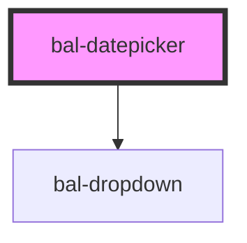

# Datepicker

An input with a simple dropdown for selecting a date.

## Basic

```html
<bal-datepicker></bal-datepicker>
```

## Set Date

```html
<bal-datepicker value="20.02.2020"></bal-datepicker>
```

## Date Range

You can limit the date range with min-date and max-date props.

```html
<bal-datepicker min-date="10.02.2020" max-date="22.02.2020" value="20.02.2020"></bal-datepicker>
```

## Filter

```html
<bal-datepicker value="20.02.2020" filter="alert()"></bal-datepicker>
```

## Disabled

```html
<bal-datepicker disabled value="20.02.2020"></bal-datepicker>
```

<!-- Auto Generated Below -->


## Properties

| Property      | Attribute     | Description                                                              | Type                        | Default                |
| ------------- | ------------- | ------------------------------------------------------------------------ | --------------------------- | ---------------------- |
| `disabled`    | `disabled`    | Disable the input                                                        | `boolean`                   | `false`                |
| `filter`      | --            | Callback to determine which date in the datepicker should be selectable. | `(date: string) => boolean` | `(_) => true`          |
| `language`    | `language`    | Language of the datepicker. Possible values are `de`, `fr`,`it` or `en`. | `string`                    | `"de"`                 |
| `maxDate`     | `max-date`    | Latest date available for selection                                      | `string`                    | `""`                   |
| `maxYear`     | `max-year`    | Latest year available for selection                                      | `string`                    | `""`                   |
| `minDate`     | `min-date`    | Earliest date available for selection                                    | `string`                    | `""`                   |
| `minYear`     | `min-year`    | Earliest year available for selection                                    | `string`                    | `""`                   |
| `placeholder` | `placeholder` | Placeholder text to render if no date has been selected.                 | `string`                    | `"Click to select..."` |
| `value`       | `value`       | The value of the datepicker with the format `dd.MM.yyyy`.                | `string`                    | `""`                   |


## Events

| Event       | Description                                          | Type                  |
| ----------- | ---------------------------------------------------- | --------------------- |
| `balChange` | Triggers when the value of the datepicker is changed | `CustomEvent<string>` |


## Methods

### `close() => Promise<void>`

Close the datepicker dropdown

#### Returns

Type: `Promise<void>`


### `open() => Promise<void>`

Open the datepicker dropdown

#### Returns

Type: `Promise<void>`


## Dependencies

### Depends on

- [bal-dropdown](../dropdown)

### Graph


----------------------------------------------

*Built with [StencilJS](https://stenciljs.com/)*
