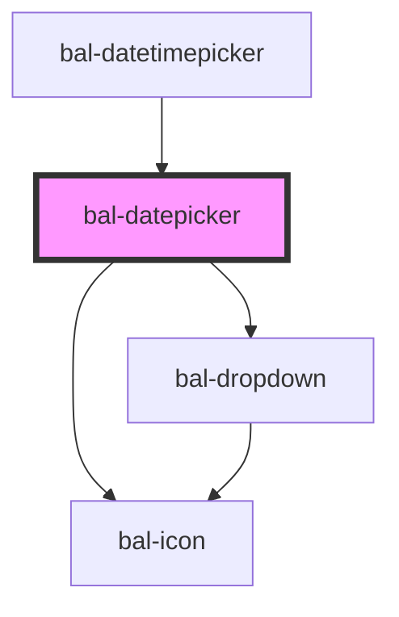

# Datepicker

An input with a simple dropdown for selecting a date.

## Usage

```html
<bal-datepicker></bal-datepicker>
```

### Set Date

```html
<bal-datepicker value="20.02.2020"></bal-datepicker>
```

### Date Range

You can limit the date range with min-date and max-date props.

<script type="text/javascript">
    document.getElementById('bal-datepicker-range-example').addEventListener('balChange', event => { 
        console.log('balChange on bal-datepicker-range-example', event) 
    });
    document.getElementById('bal-datepicker-range-example').addEventListener('balBlur', event => { 
        console.log('balBlur on bal-datepicker-range-example', event) 
    });
    document.getElementById('bal-datepicker-filter-example').filter =  function (str) {
      return parseInt(str.substring(0, 2)) == 5;
    };
</script>

```html
<bal-datepicker id="bal-datepicker-range-example" min-date="10.02.2020" max-date="22.02.2020" value="20.02.2020"></bal-datepicker>
```

### Filter

```typescript
document.getElementById('bal-datepicker-filter-example').filter =  function (str) {
  return parseInt(str.substring(0, 2)) == 5;
};
```

```html
<bal-datepicker id="bal-datepicker-filter-example"></bal-datepicker>
```

### With content

```html
<bal-datepicker value="20.02.2020">
  <p style="text-align: center;">Choose your arival date!</p>
</bal-datepicker>
```

### Disabled

```html
<bal-datepicker disabled value="20.02.2020"></bal-datepicker>
```

<!-- Auto Generated Below -->


## Properties

| Property        | Attribute         | Description                                                              | Type                        | Default                |
| --------------- | ----------------- | ------------------------------------------------------------------------ | --------------------------- | ---------------------- |
| `closeOnSelect` | `close-on-select` | Closes the datepicker dropdown after selection                           | `boolean`                   | `true`                 |
| `disabled`      | `disabled`        | Disable the input                                                        | `boolean`                   | `false`                |
| `filter`        | --                | Callback to determine which date in the datepicker should be selectable. | `(date: string) => boolean` | `(_) => true`          |
| `formatLabel`   | --                | Callback to format or modify a changed value pefore display.             | `(date: string) => string`  | `(_) => _`             |
| `language`      | `language`        | Language of the datepicker. Possible values are `de`, `fr`,`it` or `en`. | `string`                    | `"de"`                 |
| `maxDate`       | `max-date`        | Latest date available for selection                                      | `string`                    | `""`                   |
| `maxYear`       | `max-year`        | Latest year available for selection                                      | `string`                    | `""`                   |
| `minDate`       | `min-date`        | Earliest date available for selection                                    | `string`                    | `""`                   |
| `minYear`       | `min-year`        | Earliest year available for selection                                    | `string`                    | `""`                   |
| `placeholder`   | `placeholder`     | Placeholder text to render if no date has been selected.                 | `string`                    | `"Click to select..."` |
| `value`         | `value`           | The value of the datepicker with the format `dd.MM.yyyy`.                | `string`                    | `""`                   |


## Events

| Event       | Description                                          | Type                  |
| ----------- | ---------------------------------------------------- | --------------------- |
| `balBlur`   | Emitted when the toggle loses focus.                 | `CustomEvent<void>`   |
| `balChange` | Triggers when the value of the datepicker is changed | `CustomEvent<string>` |


## Methods

### `close() => Promise<void>`

Close the datepicker dropdown

#### Returns

Type: `Promise<void>`


### `open() => Promise<void>`

Open the datepicker dropdown

#### Returns

Type: `Promise<void>`


## Dependencies

### Used by

 - [bal-datetimepicker](../datetimepicker)

### Depends on

- [bal-dropdown](../dropdown)
- [bal-icon](../icon)

### Graph


----------------------------------------------

*Built with [StencilJS](https://stenciljs.com/)*
