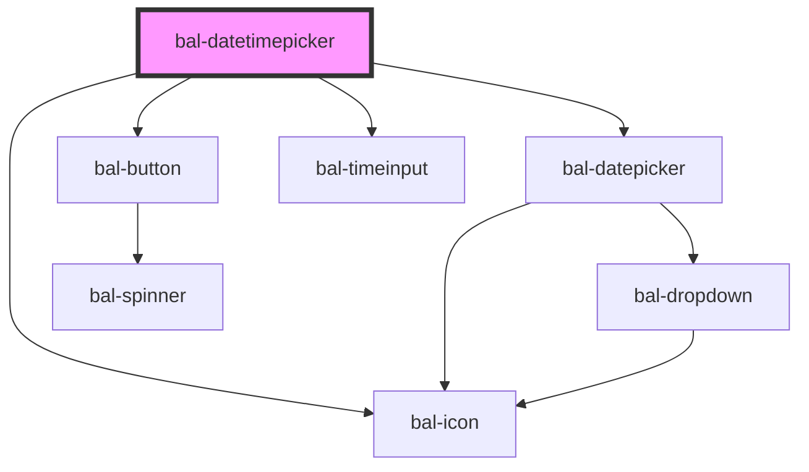

# Datetimepicker

An input with a simple dropdown for selecting a date.

## Usage

<script type="text/javascript">
    document.getElementById('bal-datetimepicker-select-example').addEventListener('balChange', event => { 
        console.log('balChange on bal-datetimepicker-select-example', event) 
    });
</script>

```html
<bal-datetimepicker id="bal-datetimepicker-select-example" ></bal-datetimepicker>
```

### Set Date

```html
<bal-datetimepicker value="20.02.2020 09:30"></bal-datetimepicker>
```

### Date Range

You can limit the date range with min-date and max-date props.

```html
<bal-datetimepicker value="20.02.2020 09:30" min-date="10.02.2020" max-date="22.02.2020"></bal-datetimepicker>
```

### Filter

```typescript
document.getElementById('with-filter').filter =  function (str) {
  return parseInt(str.substring(0, 2)) == 5;
};
```

<script type="text/javascript">
document.getElementById('with-filter').filter =  function (str) {
  return parseInt(str.substring(0, 2)) == 5;
};
</script>

```html
<bal-datetimepicker id="with-filter"></bal-datetimepicker>
```

### Disabled

```html
<bal-datetimepicker disabled value="20.02.2020 09:30"></bal-datetimepicker>
```

<!-- Auto Generated Below -->


## Properties

| Property      | Attribute     | Description                                                             | Type                        | Default                |
| ------------- | ------------- | ----------------------------------------------------------------------- | --------------------------- | ---------------------- |
| `disabled`    | `disabled`    | Disable the input                                                       | `boolean`                   | `false`                |
| `filter`      | --            | Callback to determine which date in the timepicke should be selectable. | `(date: string) => boolean` | `(_) => true`          |
| `maxDate`     | `max-date`    | Latest date available for selection                                     | `string`                    | `""`                   |
| `maxYear`     | `max-year`    | Latest year available for selection                                     | `string`                    | `""`                   |
| `minDate`     | `min-date`    | Earliest date available for selection                                   | `string`                    | `""`                   |
| `minYear`     | `min-year`    | Earliest year available for selection                                   | `string`                    | `""`                   |
| `placeholder` | `placeholder` | Placeholder text to render if no date has been selected.                | `string`                    | `"Click to select..."` |
| `value`       | `value`       | The value of the timepicke with the format `dd.MM.yyyy`.                | `string`                    | `""`                   |


## Events

| Event       | Description                                         | Type                  |
| ----------- | --------------------------------------------------- | --------------------- |
| `balChange` | Triggers when the value of the timepicke is changed | `CustomEvent<string>` |


## Methods

### `close() => Promise<void>`

Close the timepicke dropdown

#### Returns

Type: `Promise<void>`


### `open() => Promise<void>`

Open the timepicke dropdown

#### Returns

Type: `Promise<void>`


## Dependencies

### Depends on

- [bal-datepicker](../datepicker)
- [bal-button](../button)
- [bal-icon](../icon)
- [bal-timeinput](../timeinput)

### Graph


----------------------------------------------

*Built with [StencilJS](https://stenciljs.com/)*
