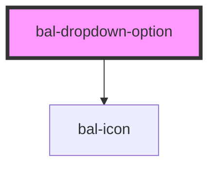

# Dropdown Option

A basic dropdown option.

## Usage

```html
<bal-dropdown-option value="1" label="Label"></bal-dropdown-option>
```

### Activated

```html
<bal-dropdown-option
  activated="true"
  value="1"
  label="Label"
></bal-dropdown-option>
```

### Highlighted

```html
<bal-dropdown-option
  highlight="bel"
  value="1"
  label="Label"
></bal-dropdown-option>
```

### With Icons

```html
<bal-dropdown-option
  icon="account"
  value="1"
  label="Label"
></bal-dropdown-option>
```

### With a Checkbox

```html
<bal-dropdown-option
  activated
  checkbox
  icon="account"
  value="1"
  label="Label"
></bal-dropdown-option>
<bal-dropdown-option
  checkbox
  icon="account"
  value="1"
  label="Label"
></bal-dropdown-option>
```

<!-- Auto Generated Below -->


## Properties

| Property    | Attribute   | Description                                                                                       | Type      | Default |
| ----------- | ----------- | ------------------------------------------------------------------------------------------------- | --------- | ------- |
| `checkbox`  | `checkbox`  | Use checkbox for multi-select                                                                     | `boolean` | `false` |
| `focused`   | `focused`   | If `true` the option is focused                                                                   | `boolean` | `false` |
| `highlight` | `highlight` | Tells witch part of the label should be highlighted                                               | `string`  | `''`    |
| `icon`      | `icon`      | Baloise icon as a prefix                                                                          | `string`  | `''`    |
| `label`     | `label`     | The value of the dropdown item. This value will be returned by the parent <bal-dropdown> element. | `string`  | `''`    |
| `selected`  | `selected`  | If `true` the option is selected                                                                  | `boolean` | `false` |
| `value`     | `value`     | The value of the dropdown item. This value will be returned by the parent <bal-dropdown> element. | `any`     | `false` |


## Methods

### `isHidden() => Promise<boolean>`


#### Returns

Type: `Promise<boolean>`


## Dependencies

### Depends on

- [bal-icon](../icon)

### Graph


----------------------------------------------

*Built with [StencilJS](https://stenciljs.com/)*
