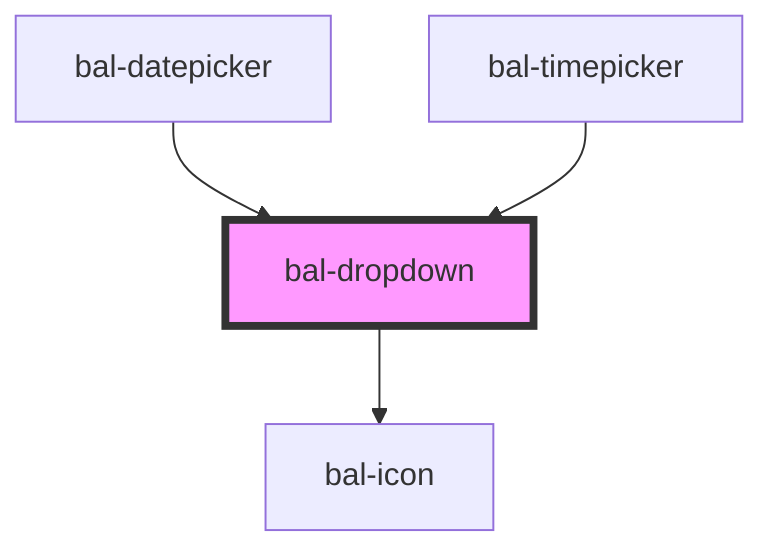

# Dropdown

## Usage

```html
<bal-dropdown selected="1">
    <bal-dropdown-option value="1" label="Ant-Man"></bal-dropdown-option>
    <bal-dropdown-option value="2" label="Black Panter"></bal-dropdown-option>
    <bal-dropdown-option value="3" label="Black Widow"></bal-dropdown-option>
</bal-dropdown>
```

```html
<bal-dropdown id="bal-dropdown-example">
    <bal-dropdown-option value="1" label="Ant-Man"></bal-dropdown-option>
    <bal-dropdown-option value="2" label="Black Panter"></bal-dropdown-option>
    <bal-dropdown-option value="3" label="Black Widow"></bal-dropdown-option>
</bal-dropdown>
```

<script type="text/javascript">
    document.getElementById('bal-dropdown-example').value = {
        label: 'Black Panter',
        value: '2'
    };
</script>

### Disabled

```html
<bal-dropdown disabled="true">
    <bal-dropdown-option value="1" label="Ant-Man"></bal-dropdown-option>
    <bal-dropdown-option value="2" label="Black Panter"></bal-dropdown-option>
    <bal-dropdown-option value="3" label="Black Widow"></bal-dropdown-option>
</bal-dropdown>
```

### Typeahead

```html
<bal-dropdown expanded typeahead>
    <bal-dropdown-option value="1" label="Ant-Man"></bal-dropdown-option>
    <bal-dropdown-option value="2" label="Black Panter"></bal-dropdown-option>
    <bal-dropdown-option value="3" label="Black Widow"></bal-dropdown-option>
    <bal-dropdown-option value="4" label="Captain America"></bal-dropdown-option>
    <bal-dropdown-option value="5" label="Captain Marvel"></bal-dropdown-option>
    <bal-dropdown-option value="6" label="Daredevil"></bal-dropdown-option>
    <bal-dropdown-option value="7" label="Dr. Strange"></bal-dropdown-option>
    <bal-dropdown-option value="8" label="Hulk"></bal-dropdown-option>
    <bal-dropdown-option value="9" label="Iron Man"></bal-dropdown-option>
    <bal-dropdown-option value="10" label="Spider Man"></bal-dropdown-option>
    <bal-dropdown-option value="11" label="Thor"></bal-dropdown-option>
    <bal-dropdown-option value="12" label="Wasp"></bal-dropdown-option>
    <bal-dropdown-option value="13" label="Wolverine"></bal-dropdown-option>
</bal-dropdown>
```


<!-- Auto Generated Below -->


## Properties

| Property      | Attribute      | Description                                                 | Type      | Default        |
| ------------- | -------------- | ----------------------------------------------------------- | --------- | -------------- |
| `disabled`    | `disabled`     | If `true`, the user cannot interact with the input.         | `boolean` | `false`        |
| `expanded`    | `expanded`     | If `true`, the component uses the whole width.              | `boolean` | `false`        |
| `fixed`       | `fixed`        | If `true`, the height of the dropdown content is fixed.     | `boolean` | `true`         |
| `placeholder` | `placeholder`  | Instructional text that shows before the input has a value. | `string`  | `""`           |
| `readonly`    | `readonly`     | If `true`, the user cannot interact with the input.         | `boolean` | `false`        |
| `triggerIcon` | `trigger-icon` | Defines the trigger icon on the right site.                 | `string`  | `"caret-down"` |
| `typeahead`   | `typeahead`    | If `true`, the use can search for the option.               | `boolean` | `false`        |
| `value`       | --             | The value of the selected dropdown item.                    | `Option`  | `null`         |


## Events

| Event       | Description                                    | Type                  |
| ----------- | ---------------------------------------------- | --------------------- |
| `balBlur`   | Emitted when the toggle loses focus.           | `CustomEvent<void>`   |
| `balChange` | Emitted when the checked property has changed. | `CustomEvent<Option>` |
| `balFocus`  | Emitted when the toggle has focus..            | `CustomEvent<void>`   |


## Methods

### `close() => Promise<void>`

Closes the dropdown menu.

#### Returns

Type: `Promise<void>`


### `getSelected() => Promise<Option>`

Returns the value of the dropdown.

#### Returns

Type: `Promise<Option>`


### `open() => Promise<void>`

Open the dropdown menu.

#### Returns

Type: `Promise<void>`


### `select(option: Option) => Promise<void>`

Selects an option.

#### Returns

Type: `Promise<void>`


### `toggle() => Promise<void>`

Open & closes the dropdown.

#### Returns

Type: `Promise<void>`


## Dependencies

### Used by

 - [bal-datepicker](../datepicker)
 - [bal-timepicker](../timepicker)

### Depends on

- [bal-icon](../icon)

### Graph


----------------------------------------------

*Built with [StencilJS](https://stenciljs.com/)*
