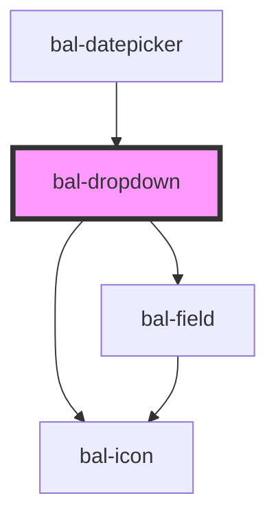

# Dropdown

## Usage

```html
<bal-dropdown id="bal-dropdown-example">
  <bal-dropdown-option value="1" label="Ant-Man"></bal-dropdown-option>
  <bal-dropdown-option value="2" label="Black Panter"></bal-dropdown-option>
  <bal-dropdown-option value="3" label="Black Widow"></bal-dropdown-option>
</bal-dropdown>
```

It can also deal with large content:

```html
<bal-dropdown>
  <bal-dropdown-option value="1" label="Loooooooooooooooooooooooooooooooooooooooooooooooooooooooooooooooooooooooooooooooooooooooooooooooooooooooooooooooooooooooooooooooooooooooooooooooooooooooooooooooooooooooooooooooooooooooongcat"></bal-dropdown-option>
  <bal-dropdown-option value="2" label="Loooooooooooooooooooooooooooooooooooooooooooooooongcat"></bal-dropdown-option>
  <bal-dropdown-option value="3" label="Looooooooooooooooooooooooooooooooooooooooooongcat"></bal-dropdown-option>
  <bal-dropdown-option value="4" label="Loooooooooooooooooooooooooooooooooooooooongcat"></bal-dropdown-option>
  <bal-dropdown-option value="5" label="Looooooooooooooooooooooooooooooooooooongcat"></bal-dropdown-option>
  <bal-dropdown-option value="6" label="Looooooooooooooooooooooooooooooooongcat"></bal-dropdown-option>
  <bal-dropdown-option value="7" label="Longcat"></bal-dropdown-option>
</bal-dropdown>
```

<script type="text/javascript">
    document.getElementById('bal-dropdown-example').value = {
        label: 'Black Panter',
        value: '2'
    }
    document.getElementById('bal-dropdown-example').addEventListener('balBlur', event => { 
        console.log('balBlur on bal-dropdown-example', event) 
    })
    document.getElementById('bal-dropdown-typeahead-example').addEventListener('balInput', event => { 
        console.log('balInput on bal-dropdown-typeahead-example', event) 
    })
    document.getElementById('bal-dropdown-typeahead-example').addEventListener('balChange', event => { 
        console.log('balChange on bal-dropdown-typeahead-example', event) 
    })
    document.getElementById('bal-dropdown-typeahead-example').addEventListener('balBlur', event => { 
        console.log('balBlur on bal-dropdown-typeahead-example', event) 
    })
</script>

### Custom empty message

```html
<bal-dropdown empty>
  <bal-dropdown-option value="1" label="Ant-Man"></bal-dropdown-option>
  <bal-dropdown-option value="2" label="Black Panter"></bal-dropdown-option>
  <bal-dropdown-option value="3" label="Black Widow"></bal-dropdown-option>
  <span slot="is-empty">No Results here! :-(</span>
</bal-dropdown>
```

### Custom options style

```html
<bal-dropdown>
  <bal-dropdown-option value="1" search-term="Ant Man San Franciso" label="Ant-Man">
    <b>Ant Man</b><br>
    <span>San Franciso</span>
  </bal-dropdown-option>
  <bal-dropdown-option value="2" search-term="Black Panter Wakanda" label="Black Panter">
   <b>Black Panter</b><br>
   <span>Wakanda</span>
  </bal-dropdown-option>
  <bal-dropdown-option value="3" search-term="Black Widow Russia" label="Black Widow">
   <b>Black Widow</b><br>
   <span>Russia</span>
  </bal-dropdown-option>
</bal-dropdown>
```

### Inverted style

```html
<div class="has-background-info is-padded">
  <bal-dropdown inverted>
    <bal-dropdown-option value="1" label="Ant-Man"></bal-dropdown-option>
    <bal-dropdown-option value="2" label="Black Panter"></bal-dropdown-option>
    <bal-dropdown-option value="3" label="Black Widow"></bal-dropdown-option>
  </bal-dropdown>
</div>
```

### Disabled

```html
<bal-dropdown disabled="true">
  <bal-dropdown-option value="1" label="Ant-Man"></bal-dropdown-option>
  <bal-dropdown-option value="2" label="Black Panter"></bal-dropdown-option>
  <bal-dropdown-option value="3" label="Black Widow"></bal-dropdown-option>
</bal-dropdown>
```

### Typeahead

```html
<bal-dropdown expanded typeahead id="bal-dropdown-typeahead-example">
  <bal-dropdown-option value="1" label="Ant-Man"></bal-dropdown-option>
  <bal-dropdown-option value="2" label="Black Panter"></bal-dropdown-option>
  <bal-dropdown-option value="3" label="Black Widow"></bal-dropdown-option>
  <bal-dropdown-option value="4" label="Captain America"></bal-dropdown-option>
  <bal-dropdown-option value="5" label="Captain Marvel"></bal-dropdown-option>
  <bal-dropdown-option value="6" label="Daredevil"></bal-dropdown-option>
  <bal-dropdown-option value="7" label="Dr. Strange"></bal-dropdown-option>
  <bal-dropdown-option value="8" label="Hulk"></bal-dropdown-option>
  <bal-dropdown-option value="9" label="Iron Man"></bal-dropdown-option>
  <bal-dropdown-option value="10" label="Spider Man"></bal-dropdown-option>
  <bal-dropdown-option value="11" label="Thor"></bal-dropdown-option>
  <bal-dropdown-option value="12" label="Wasp"></bal-dropdown-option>
  <bal-dropdown-option value="13" label="Wolverine"></bal-dropdown-option>
</bal-dropdown>
```

### Multi-Select

```html
<bal-dropdown multi-select expanded>
  <bal-dropdown-option checkbox value="1" label="Ant-Man"></bal-dropdown-option>
  <bal-dropdown-option checkbox value="2" label="Black Panter"></bal-dropdown-option>
  <bal-dropdown-option checkbox value="3" label="Black Widow"></bal-dropdown-option>
  <bal-dropdown-option checkbox value="4" label="Captain America"></bal-dropdown-option>
  <bal-dropdown-option checkbox value="5" label="Captain Marvel"></bal-dropdown-option>
  <bal-dropdown-option checkbox value="6" label="Daredevil"></bal-dropdown-option>
  <bal-dropdown-option checkbox value="7" label="Dr. Strange"></bal-dropdown-option>
  <bal-dropdown-option checkbox value="8" label="Hulk"></bal-dropdown-option>
</bal-dropdown>
```

#### With typeahead

```html
<bal-dropdown multi-select typeahead expanded>
  <bal-dropdown-option checkbox value="1" label="Ant-Man"></bal-dropdown-option>
  <bal-dropdown-option checkbox value="2" label="Black Panter"></bal-dropdown-option>
  <bal-dropdown-option checkbox value="3" label="Black Widow"></bal-dropdown-option>
  <bal-dropdown-option checkbox value="4" label="Captain America"></bal-dropdown-option>
  <bal-dropdown-option checkbox value="5" label="Captain Marvel"></bal-dropdown-option>
  <bal-dropdown-option checkbox value="6" label="Daredevil"></bal-dropdown-option>
  <bal-dropdown-option checkbox value="7" label="Dr. Strange"></bal-dropdown-option>
  <bal-dropdown-option checkbox value="8" label="Hulk"></bal-dropdown-option>
  <bal-dropdown-option checkbox value="9" label="Iron Man"></bal-dropdown-option>
  <bal-dropdown-option checkbox value="10" label="Spider Man"></bal-dropdown-option>
  <bal-dropdown-option checkbox value="11" label="Thor"></bal-dropdown-option>
  <bal-dropdown-option checkbox value="12" label="Wasp"></bal-dropdown-option>
  <bal-dropdown-option checkbox value="13" label="Wolverine"></bal-dropdown-option>
  <span slot="no-search-results">No results here with your search term! :-(</span>
</bal-dropdown>
```

<!-- Auto Generated Below -->


## Properties

| Property      | Attribute      | Description                                                 | Type                           | Default        |
| ------------- | -------------- | ----------------------------------------------------------- | ------------------------------ | -------------- |
| `disabled`    | `disabled`     | If `true`, the user cannot interact with the input.         | `boolean`                      | `false`        |
| `empty`       | `empty`        | If `true` the dropdown shows the empty message              | `boolean`                      | `false`        |
| `expanded`    | `expanded`     | If `true`, the component uses the whole width.              | `boolean`                      | `false`        |
| `fixed`       | `fixed`        | If `true`, the height of the dropdown content is fixed.     | `boolean`                      | `true`         |
| `inverted`    | `inverted`     | If `true` the dropdown can be used on blue background.      | `boolean`                      | `false`        |
| `multiSelect` | `multi-select` | If `true` the dropdown allows multiple selection            | `boolean`                      | `false`        |
| `placeholder` | `placeholder`  | Instructional text that shows before the input has a value. | `string`                       | `''`           |
| `readonly`    | `readonly`     | If `true`, the user cannot interact with the input.         | `boolean`                      | `false`        |
| `triggerIcon` | `trigger-icon` | Defines the trigger icon on the right site.                 | `string`                       | `'caret-down'` |
| `typeahead`   | `typeahead`    | If `true`, the use can search for the option.               | `boolean`                      | `false`        |
| `value`       | --             | The value of the selected dropdown item.                    | `Option<any> \| Option<any>[]` | `null`         |


## Events

| Event       | Description                                                | Type                       |
| ----------- | ---------------------------------------------------------- | -------------------------- |
| `balBlur`   | Emitted when the toggle loses focus.                       | `CustomEvent<void>`        |
| `balChange` | Emitted when the checked property has changed.             | `CustomEvent<Option<any>>` |
| `balFocus`  | Emitted when the toggle has focus..                        | `CustomEvent<void>`        |
| `balInput`  | Emitted when containing input field raises an input event. | `CustomEvent<string>`      |


## Methods

### `close() => Promise<void>`

Closes the dropdown menu.

#### Returns

Type: `Promise<void>`


### `getSelected() => Promise<Option<any> | Option<any>[]>`

Returns the value of the dropdown.

#### Returns

Type: `Promise<Option<any> | Option<any>[]>`


### `open() => Promise<void>`

Open the dropdown menu.

#### Returns

Type: `Promise<void>`


### `select(option: Option<any>) => Promise<void>`

Selects an option.

#### Returns

Type: `Promise<void>`


### `toggle() => Promise<void>`

Open & closes the dropdown.

#### Returns

Type: `Promise<void>`


## Shadow Parts

| Part                | Description |
| ------------------- | ----------- |
| `"content-options"` |             |
| `"input"`           |             |


## Dependencies

### Used by

 - [bal-datepicker](../datepicker)

### Depends on

- [bal-icon](../icon)
- [bal-field](../field)

### Graph


----------------------------------------------

*Built with [StencilJS](https://stenciljs.com/)*
