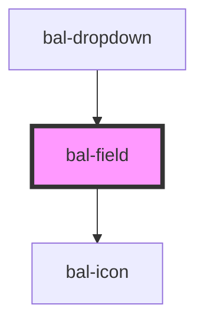

# Field

All generic form field, designed for consistency 

## Usage

```html
<bal-field label="Firstname">
    <input class="input" placeholder="Enter firstname here" />
</bal-field>
```

### Inverted style

```html
<div class="has-background-info is-padded" >
    <bal-field label="Firstname" validation-message="Field is required" inverted>
        <input class="input" placeholder="Enter firstname here" />
    </bal-field>
</div>
```

###  Validation

```html
<bal-field label="Lastname" required validation-message="Field is required">
    <input class="input" placeholder="Enter lastname here" />
</bal-field>
```

### Icons

```html
<bal-field label="Lastname" icon-left="account" icon-right="check">
    <input class="input" placeholder="Enter lastname here" />
</bal-field>
```


<!-- Auto Generated Below -->


## Properties

| Property            | Attribute            | Description                                         | Type      | Default |
| ------------------- | -------------------- | --------------------------------------------------- | --------- | ------- |
| `iconLeft`          | `icon-left`          | Baloise icon for the left side of the input         | `string`  | `""`    |
| `iconRight`         | `icon-right`         | Baloise icon for the right side of the input        | `string`  | `""`    |
| `inverted`          | `inverted`           | If `true` the field can be used on blue background. | `boolean` | `false` |
| `label`             | `label`              | Label text                                          | `string`  | `""`    |
| `required`          | `required`           | If `true` a asterix (*) is added to the label text  | `boolean` | `false` |
| `validationMessage` | `validation-message` | Validation message text                             | `string`  | `""`    |


## Dependencies

### Used by

 - [bal-dropdown](../dropdown)

### Depends on

- [bal-icon](../icon)

### Graph


----------------------------------------------

*Built with [StencilJS](https://stenciljs.com/)*
