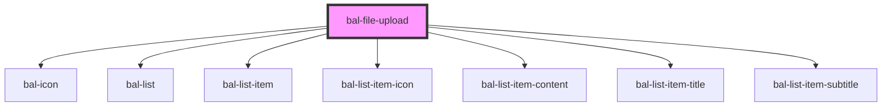

# File Upload

The `bal-file-upload` is all in one component. It supports drag&drop and the normal file upload dialog of the browser.

## Usage

<div id="bal-file-upload-messages" class="bal-app"></div>

```html
<bal-file-upload
  id="bal-file-upload-example"
  accept="image/png,image/jpeg"
  max-files="3"
  max-file-size="1000000"
  max-bundle-size="1000000"
></bal-file-upload>
```

<script type="text/javascript">
    var messages = [];
    document
        .getElementById('bal-file-upload-example')
        .addEventListener('balFileUploadRejectedFile', event => { 
            var div = document.createElement('div');
            var text = document.createTextNode('The file "' + event.detail.file.name
                + '" could not be uploaded, because of "' + event.detail.reasons.join(', ') + '"');
            div.appendChild(text);
            div.setAttribute('class', 'notification is-warning');
            document.getElementById('bal-file-upload-messages').appendChild(div)
    });
</script>

<!-- Auto Generated Below -->


## Properties

| Property        | Attribute         | Description                                      | Type      | Default                      |
| --------------- | ----------------- | ------------------------------------------------ | --------- | ---------------------------- |
| `accept`        | `accept`          | Accepted MIME-Types like `image/png,image/jpeg`. | `string`  | `""`                         |
| `disabled`      | `disabled`        | If `true` the button is disabled                 | `boolean` | `undefined`                  |
| `label`         | `label`           | Label of the drop area.                          | `string`  | `"Choose or drop a file..."` |
| `maxBundleSize` | `max-bundle-size` | Allowed max bundle size in bytes.                | `number`  | `undefined`                  |
| `maxFileSize`   | `max-file-size`   | Allowed max file size in bytes.                  | `number`  | `undefined`                  |
| `maxFiles`      | `max-files`       | Allowed number of files in the bundle.           | `number`  | `undefined`                  |
| `multiple`      | `multiple`        | If `true` multiple file upload is possible.      | `boolean` | `true`                       |


## Events

| Event                       | Description                                                              | Type                                  |
| --------------------------- | ------------------------------------------------------------------------ | ------------------------------------- |
| `balChange`                 | Triggers when a file is added or removed.                                | `CustomEvent<File[]>`                 |
| `balFileUploadRejectedFile` | Triggers when a file is rejected due to not allowed MIME-Type and so on. | `CustomEvent<FileUploadRejectedFile>` |


## Dependencies

### Depends on

- [bal-icon](../icon)
- [bal-list](../list)
- [bal-list-item](../list-item)
- [bal-list-item-icon](../list-item-icon)
- [bal-list-item-content](../list-item-content)
- [bal-list-item-title](../list-item-title)
- [bal-list-item-subtitle](../list-item-subtitle)

### Graph


----------------------------------------------

*Built with [StencilJS](https://stenciljs.com/)*
