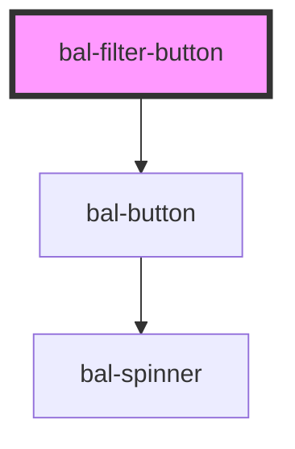

# Filter Button

These buttons can be used for filtering lists

## Usage

```html
<bal-filter-button id="bal-filter-button-1" active="true"
  >X-Men (12)</bal-filter-button
>
<bal-filter-button>Defenders (4)</bal-filter-button>
<bal-filter-button>Avengers (8)</bal-filter-button>
```

> Hint: Open the console to see some action.

<script type="text/javascript">
    document.getElementById('bal-filter-button-1').addEventListener('balChange', event => { 
      console.log('bal-filter-button-1 has been changed! value=' + event.detail );
    });
</script>

<!-- Auto Generated Below -->


## Properties

| Property | Attribute | Description                                  | Type      | Default |
| -------- | --------- | -------------------------------------------- | --------- | ------- |
| `active` | `active`  | If `true` then the button is active/selected | `boolean` | `false` |


## Events

| Event       | Description                                             | Type                   |
| ----------- | ------------------------------------------------------- | ---------------------- |
| `balChange` | Triggers when the value of the filter-button is changed | `CustomEvent<boolean>` |


## Dependencies

### Depends on

- [bal-button](../button)

### Graph


----------------------------------------------

*Built with [StencilJS](https://stenciljs.com/)*
