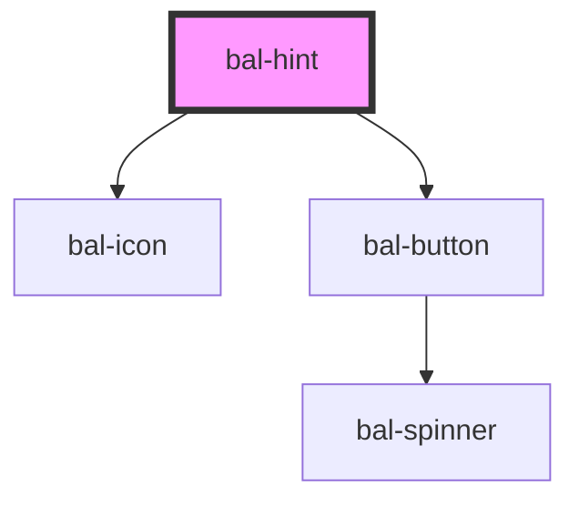

# Hint

Display a helper text. Use this to explain complicted form fields.

## Usage

```html
<bal-hint>
  <bal-hint-title>Spider-Man</bal-hint-title>
  <bal-hint-text>
    Spider-Man is a fictional superhero created by writer-editor Stan Lee and
    writer-artist Steve Ditko. He first appeared in the anthology comic book
    Amazing Fantasy #15 (August 1962) in the Silver Age of Comic Books. He
    appears in American comic books published by Marvel Comics, as well as in a
    number of movies, television shows, and video game adaptations set in the
    Marvel Universe.
  </bal-hint-text>
</bal-hint>
```

```html
<bal-field label="Firstname">
  <bal-hint slot="hint">
    <bal-hint-title>Firstname</bal-hint-title>
    <bal-hint-text>
      Lorem ipsum dolor sit amet, consetetur sadipscing elitr, sed diam nonumy
      eirmod tempor invidunt ut labore et dolore magna aliquyam erat, sed diam
      voluptua.
    </bal-hint-text>
  </bal-hint>
  <input class="input" placeholder="Enter firstname here" />
</bal-field>
```

<!-- Auto Generated Below -->

## Properties

| Property     | Attribute     | Description                                         | Type      | Default   |
| ------------ | ------------- | --------------------------------------------------- | --------- | --------- |
| `closeLabel` | `close-label` | Text for the close button.                          | `string`  | `"Close"` |
| `disabled`   | `disabled`    | If `true`, the user cannot interact with the input. | `boolean` | `false`   |

## Methods

### `close() => Promise<void>`

Closes the hint box.

#### Returns

Type: `Promise<void>`

### `open() => Promise<void>`

Opens the hint box.

#### Returns

Type: `Promise<void>`

### `toggle() => Promise<void>`

Toggles the hint box.

#### Returns

Type: `Promise<void>`

## Dependencies

### Depends on

- [bal-icon](../icon)
- [bal-button](../button)

### Graph



---

_Built with [StencilJS](https://stenciljs.com/)_
