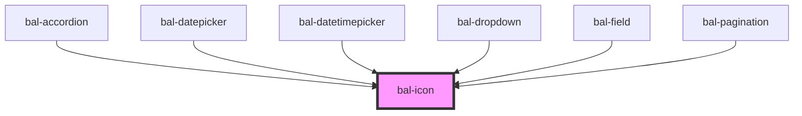

# Icon

The Baloise SVG icons have been converted with this [tool](https://websemantics.uk/tools/svg-to-background-image-conversion/).

## Usage

Here is how you can change the size:

```html
<bal-icon name="account" size="small"></bal-icon>
<bal-icon name="account"></bal-icon>
<bal-icon name="account" size="medium"></bal-icon>
<bal-icon name="account" size="large"></bal-icon>
```

## Icons

| Icon | Name |
| ---- | ---- |   
| <bal-icon name="account" size="medium" /> | `account` |   
| <bal-icon name="alert-circle" size="medium" /> | `alert-circle` |   
| <bal-icon name="alert" size="medium" /> | `alert` |   
| <bal-icon name="answer" size="medium" /> | `answer` |   
| <bal-icon name="call" size="medium" /> | `call` |   
| <bal-icon name="caret-down" size="medium" /> | `caret-down` |   
| <bal-icon name="caret-left" size="medium" /> | `caret-left` |   
| <bal-icon name="caret-right" size="medium" /> | `caret-right` |   
| <bal-icon name="caret-up" size="medium" /> | `caret-up` |   
| <bal-icon name="check-circle" size="medium" /> | `check-circle` |   
| <bal-icon name="check" size="medium" /> | `check` |   
| <bal-icon name="close-small" size="medium" /> | `close-small` |   
| <bal-icon name="close-big" size="medium" /> | `close-big` |   
| <bal-icon name="close-thin" size="medium" /> | `close-thin` |   
| <bal-icon name="contact" size="medium" /> | `contact` |   
| <bal-icon name="document" size="medium" /> | `document` |   
| <bal-icon name="download" size="medium" /> | `download` |   
| <bal-icon name="edit" size="medium" /> | `edit` |   
| <bal-icon name="date" size="medium" /> | `date` |   
| <bal-icon name="general-consultant" size="medium" /> | `general-consultant` |   
| <bal-icon name="general-edit" size="medium" /> | `general-edit` |   
| <bal-icon name="info" size="medium" /> | `info` |   
| <bal-icon name="info-circle" size="medium" /> | `info-circle` |   
| <bal-icon name="locate" size="medium" /> | `locate` |   
| <bal-icon name="copy" size="medium" /> | `copy` |   
| <bal-icon name="location" size="medium" /> | `location` |   
| <bal-icon name="menu-dots" size="medium" /> | `menu-dots` |   
| <bal-icon name="message" size="medium" /> | `message` |   
| <bal-icon name="minus" size="medium" /> | `minus` |   
| <bal-icon name="menu-bars" size="medium" /> | `menu-bars` |   
| <bal-icon name="nav-back" size="medium" /> | `nav-back` |   
| <bal-icon name="nav-go-large" size="medium" /> | `nav-go-large` |   
| <bal-icon name="nav-go-left-no-padding" size="medium" /> | `nav-go-left-no-padding` |   
| <bal-icon name="nav-go-right-no-padding" size="medium" /> | `nav-go-right-no-padding` |   
| <bal-icon name="nav-success" size="medium" /> | `nav-success` |   
| <bal-icon name="nav-go-up" size="medium" /> | `nav-go-up` |   
| <bal-icon name="plus" size="medium" /> | `plus` |   
| <bal-icon name="nav-go-right" size="medium" /> | `nav-go-right` |   
| <bal-icon name="nav-go-small" size="medium" /> | `nav-go-small` |   
| <bal-icon name="refresh" size="medium" /> | `refresh` |   
| <bal-icon name="nav-go-left" size="medium" /> | `nav-go-left` |   
| <bal-icon name="social-facebook-line" size="medium" /> | `social-facebook-line` |   
| <bal-icon name="social-xing-line" size="medium" /> | `social-xing-line` |   
| <bal-icon name="read-only" size="medium" /> | `read-only` |   
| <bal-icon name="social-linkedin-line" size="medium" /> | `social-linkedin-line` |   
| <bal-icon name="upload" size="medium" /> | `upload` |   
| <bal-icon name="search" size="medium" /> | `search` |   
| <bal-icon name="nav-go-down" size="medium" /> | `nav-go-down` |   
| <bal-icon name="nav-dropdown" size="medium" /> | `nav-dropdown` |   
| <bal-icon name="trash" size="medium" /> | `trash` | 
| <bal-icon name="clock" size="medium" /> | `clock` | 


<!-- Auto Generated Below -->


## Properties

| Property  | Attribute  | Description                                       | Type                                   | Default |
| --------- | ---------- | ------------------------------------------------- | -------------------------------------- | ------- |
| `isLeft`  | `is-left`  |                                                   | `boolean`                              | `false` |
| `isRight` | `is-right` |                                                   | `boolean`                              | `false` |
| `name`    | `name`     | The name of the icon without the bal-icon prefix. | `string`                               | `""`    |
| `size`    | `size`     | Defines the size of the icon.                     | `"" \| "large" \| "medium" \| "small"` | `""`    |


## Dependencies

### Used by

 - [bal-accordion](../accordion)
 - [bal-datepicker](../datepicker)
 - [bal-datetimepicker](../datetimepicker)
 - [bal-dropdown](../dropdown)
 - [bal-field](../field)
 - [bal-pagination](../pagination)

### Graph


----------------------------------------------

*Built with [StencilJS](https://stenciljs.com/)*
