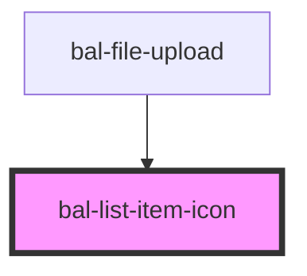

# List Item Icon

## Usage

```html
<bal-list-item disabled>
  <bal-list-item-icon>
    <bal-icon size="medium" name="document"></bal-icon>
  </bal-list-item-icon>
  <bal-list-item-content>
    <bal-list-item-title>Document.pdf</bal-list-item-title>
    <bal-list-item-subtitle>20.03.1998</bal-list-item-subtitle>
  </bal-list-item-content>
  <bal-list-item-icon right>
    <bal-icon size="medium" name="download"></bal-icon>
  </bal-list-item-icon>
</bal-list-item>
```

<!-- Auto Generated Below -->


## Properties

| Property | Attribute | Description                                                                         | Type      | Default |
| -------- | --------- | ----------------------------------------------------------------------------------- | --------- | ------- |
| `right`  | `right`   | If `true` the icon is on the right side of the list item. Default is the left side. | `boolean` | `false` |


## Dependencies

### Used by

 - [bal-file-upload](../file-upload)

### Graph


----------------------------------------------

*Built with [StencilJS](https://stenciljs.com/)*
