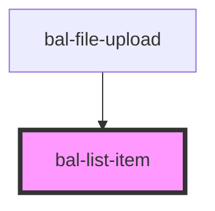

# List Item

## Usage

```html
<bal-list-item>
  <bal-list-item-content>
    <bal-list-item-title>Link A</bal-list-item-title>
  </bal-list-item-content>
  <bal-list-item-icon right>
    <bal-icon size="medium" name="nav-go-large"></bal-icon>
  </bal-list-item-icon>
</bal-list-item>
```

### Selected

```html
<bal-list-item selected>
  <bal-list-item-content>
    <bal-list-item-title>Link A</bal-list-item-title>
  </bal-list-item-content>
  <bal-list-item-icon right>
    <bal-icon size="medium" name="nav-go-large"></bal-icon>
  </bal-list-item-icon>
</bal-list-item>
```

### Disabled

```html
<bal-list-item disabled>
  <bal-list-item-content>
    <bal-list-item-title>Link A</bal-list-item-title>
  </bal-list-item-content>
  <bal-list-item-icon right>
    <bal-icon size="medium" name="nav-go-large"></bal-icon>
  </bal-list-item-icon>
</bal-list-item>
```

<!-- Auto Generated Below -->


## Properties

| Property   | Attribute  | Description                                  | Type      | Default |
| ---------- | ---------- | -------------------------------------------- | --------- | ------- |
| `disabled` | `disabled` | If `true` the list item can be hovered       | `boolean` | `false` |
| `selected` | `selected` | If `true` the list item has a selected theme | `boolean` | `false` |


## Dependencies

### Used by

 - [bal-file-upload](../file-upload)

### Graph


----------------------------------------------

*Built with [StencilJS](https://stenciljs.com/)*
