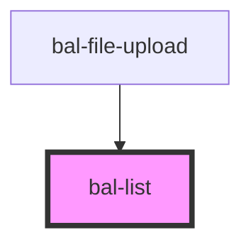

# List

Lists present content in a way that makes it easy to identify a specific item in a collection.

## Usage

```html
<bal-list disabled class="box is-padded">
  <bal-list-item>
    <bal-list-item-content>
      <bal-list-item-title>Single-line item</bal-list-item-title>
    </bal-list-item-content>
  </bal-list-item>

  <bal-list-item>
    <bal-list-item-content>
      <bal-list-item-title>Two-line item</bal-list-item-title>
      <bal-list-item-subtitle>Secondary text</bal-list-item-subtitle>
    </bal-list-item-content>
  </bal-list-item>
</bal-list>
```

### With borders

```html
<bal-list border>
  <bal-list-item>
    <bal-list-item-content>
      <bal-list-item-title>Single-line item</bal-list-item-title>
    </bal-list-item-content>
  </bal-list-item>
  <bal-list-item selected>
    <bal-list-item-content>
      <bal-list-item-title>Selected item</bal-list-item-title>
    </bal-list-item-content>
  </bal-list-item>
  <bal-list-item disabled>
    <bal-list-item-content>
      <bal-list-item-title>Two-line item</bal-list-item-title>
      <bal-list-item-subtitle>Secondary text</bal-list-item-subtitle>
    </bal-list-item-content>
  </bal-list-item>
</bal-list>
```

### Inverted

```html
<div class="has-background-info is-padded">
  <bal-list inverted border>
    <bal-list-item>
      <bal-list-item-content>
        <bal-list-item-title>Two-line item</bal-list-item-title>
        <bal-list-item-subtitle>Secondary text</bal-list-item-subtitle>
      </bal-list-item-content>
    </bal-list-item>
    <bal-list-item>
      <bal-list-item-content>
        <bal-list-item-title>Two-line item</bal-list-item-title>
        <bal-list-item-subtitle>Secondary text</bal-list-item-subtitle>
      </bal-list-item-content>
    </bal-list-item>
  </bal-list>
</div>
```

### With Icons

```html
<bal-list class="box is-padded">
  <bal-list-item>
    <bal-list-item-icon>
      <bal-icon size="medium" name="account"></bal-icon>
    </bal-list-item-icon>
    <bal-list-item-content>
      <bal-list-item-title>Tony Stark</bal-list-item-title>
      <bal-list-item-subtitle>Stark Industries</bal-list-item-subtitle>
    </bal-list-item-content>
  </bal-list-item>

  <bal-list-item>
    <bal-list-item-icon>
      <bal-icon size="medium" name="check"></bal-icon>
    </bal-list-item-icon>
    <bal-list-item-content>
      <bal-list-item-title class="has-text-black">Avenger</bal-list-item-title>
    </bal-list-item-content>
  </bal-list-item>

  <bal-list-item>
    <bal-list-item-icon>
      <bal-icon size="medium" name="document"></bal-icon>
    </bal-list-item-icon>
    <bal-list-item-content>
      <bal-list-item-title>Document.pdf</bal-list-item-title>
      <bal-list-item-subtitle>20.03.1998</bal-list-item-subtitle>
    </bal-list-item-content>
    <bal-list-item-icon right>
      <bal-icon size="medium" name="download"></bal-icon>
    </bal-list-item-icon>
  </bal-list-item>
</bal-list>
```

### Link

```html
<bal-list class="box is-padded">
  <bal-list-item>
    <bal-list-item-content>
      <bal-list-item-title>Link A</bal-list-item-title>
    </bal-list-item-content>
    <bal-list-item-icon right>
      <bal-icon size="medium" name="nav-go-large"></bal-icon>
    </bal-list-item-icon>
  </bal-list-item>
  <bal-list-item disabled>
    <bal-list-item-content>
      <bal-list-item-title>Disabled Link B</bal-list-item-title>
    </bal-list-item-content>
    <bal-list-item-icon right>
      <bal-icon size="medium" name="nav-go-large"></bal-icon>
    </bal-list-item-icon>
  </bal-list-item>
</bal-list>
```

### With multiple columns

```html
<bal-list border class="box is-padded">
  <bal-list-item>
    <bal-list-item-content>
      <div class="columns">
        <div class="column">
          <bal-list-item-title>14.02.2020</bal-list-item-title>
        </div>
        <div class="column">
          <bal-list-item-title>Link A</bal-list-item-title>
        </div>
      </div>
    </bal-list-item-content>
    <bal-list-item-icon right>
      <bal-icon size="medium" name="nav-go-large"></bal-icon>
    </bal-list-item-icon>
  </bal-list-item>

  <bal-list-item>
    <bal-list-item-content>
      <div class="columns">
        <div class="column">
          <bal-list-item-title>03.04.2020</bal-list-item-title>
        </div>
        <div class="column">
          <bal-list-item-title>Link B</bal-list-item-title>
        </div>
      </div>
    </bal-list-item-content>
    <bal-list-item-icon right>
      <bal-icon size="medium" name="nav-go-large"></bal-icon>
    </bal-list-item-icon>
  </bal-list-item>
</bal-list>
```

<!-- Auto Generated Below -->


## Properties

| Property   | Attribute  | Description                                        | Type      | Default |
| ---------- | ---------- | -------------------------------------------------- | --------- | ------- |
| `border`   | `border`   | If `true` each list item has a bottom border       | `boolean` | `false` |
| `disabled` | `disabled` | If `true` the list item can be hovered             | `boolean` | `false` |
| `inverted` | `inverted` | If `true` the list can be used on a dark backround | `boolean` | `false` |


## Dependencies

### Used by

 - [bal-file-upload](../file-upload)

### Graph


----------------------------------------------

*Built with [StencilJS](https://stenciljs.com/)*
