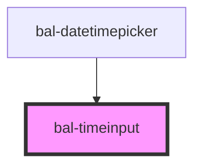

# Timeinput

An input deticated for gathering the time.

## Usage

```html
<bal-timeinput id="bal-timeinput-example" value="12:30"></bal-timeinput>
<bal-timeinput></bal-timeinput>
```

<script type="text/javascript">
    document.getElementById('bal-timeinput-example').addEventListener('balInput', event => { 
        console.log('balInput on bal-timeinput-example', event) 
    });
    document.getElementById('bal-timeinput-example').addEventListener('balBlur', event => { 
        console.log('balBlur on bal-timeinput-example') 
    });
</script>

## Disabled

```html
<bal-timeinput value="23:10" disabled="true"></bal-timeinput>
```

<!-- Auto Generated Below -->


## Properties

| Property   | Attribute  | Description                                          | Type      | Default     |
| ---------- | ---------- | ---------------------------------------------------- | --------- | ----------- |
| `disabled` | `disabled` | If `true` the button is disabled                     | `boolean` | `undefined` |
| `value`    | `value`    | The value of the datepicker with the format `hh:mm`. | `string`  | `""`        |


## Events

| Event      | Description                                                                                         | Type                  |
| ---------- | --------------------------------------------------------------------------------------------------- | --------------------- |
| `balBlur`  | Emitted when either the hour or minute input field loses focus.                                     | `CustomEvent<void>`   |
| `balInput` | Emitted when either the hour or the minute input has changed. It will always return a valid number. | `CustomEvent<string>` |


## Dependencies

### Used by

 - [bal-datetimepicker](../datetimepicker)

### Graph


----------------------------------------------

*Built with [StencilJS](https://stenciljs.com/)*
