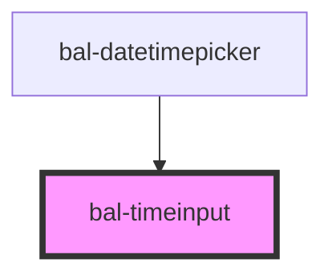

# Timeinput

An input deticated for gathering the time.

## Usage

```html
<bal-timeinput id="bal-timeinput-example" value="12:30"></bal-timeinput>
<bal-timeinput></bal-timeinput>
```

<script type="text/javascript">
    document.getElementById('bal-timeinput-example').addEventListener('balChange', event => { 
        console.log('balChange on bal-timeinput-example', event) 
    });
    document.getElementById('bal-timeinput-example').addEventListener('balBlur', event => { 
        console.log('balBlur on bal-timeinput-example') 
    });
</script>

### Inverted style

```html
<div class="has-background-info is-padded">
    <bal-timeinput id="bal-timeinput-example" value="12:30" inverted></bal-timeinput>
    <bal-timeinput inverted></bal-timeinput>
</div>
```


## Min and max time

```html
<bal-timeinput value="12:30" min-time="09:30" max-time="18:00"></bal-timeinput>
<bal-timeinput value="12:30" min-time="09:10" max-time="09:40"></bal-timeinput>
```

## Disabled

```html
<bal-timeinput value="23:10" disabled="true"></bal-timeinput>
```

<!-- Auto Generated Below -->


## Properties

| Property   | Attribute  | Description                                             | Type      | Default     |
| ---------- | ---------- | ------------------------------------------------------- | --------- | ----------- |
| `disabled` | `disabled` | If `true` the button is disabled                        | `boolean` | `undefined` |
| `inverted` | `inverted` | If `true` the timeinput can be used on blue background. | `boolean` | `false`     |
| `maxTime`  | `max-time` | Latest date available for selection                     | `string`  | `""`        |
| `minTime`  | `min-time` | Earliest date available for selection                   | `string`  | `""`        |
| `value`    | `value`    | The value of the datepicker with the format `hh:mm`.    | `string`  | `""`        |


## Events

| Event                | Description                                                                                                                                                    | Type                  |
| -------------------- | -------------------------------------------------------------------------------------------------------------------------------------------------------------- | --------------------- |
| `balBlur`            | Emitted when either the hour or minute input field loses focus.                                                                                                | `CustomEvent<void>`   |
| `balTimeinputChange` | Emitted when either the hour or the minute input has changed. It will not be triggert if either hour or time input has never been set (i.e. "--" is selected). | `CustomEvent<string>` |


## Dependencies

### Used by

 - [bal-datetimepicker](../datetimepicker)

### Graph


----------------------------------------------

*Built with [StencilJS](https://stenciljs.com/)*
