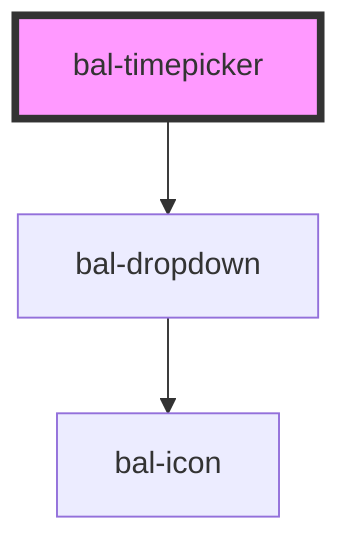

# Timepicker

An input with a simple dropdown for selecting a date.

## Usage

```html
<bal-timepicker></bal-timepicker>
```

### Set Date

```html
<bal-timepicker value="12:00"></bal-timepicker>
```

### Date Range

You can limit the date range with min-time and max-time props.

```html
<bal-timepicker min-time="09:00" max-time="19:00" value="10:00"></bal-timepicker>
```

### Filter

```typescript
document.getElementById('with-filter').filter =  function (str) {
  return parseInt(str.substring(0, 2)) == 5;
};
```

<script type="text/javascript">
document.getElementById('with-filter').filter =  function (str) {
  return parseInt(str.substring(0, 2)) == 5;
};
</script>

```html
<bal-timepicker id="with-filter"></bal-timepicker>
```

### Disabled

```html
<bal-timepicker disabled value="20.02.2020"></bal-timepicker>
```

<!-- Auto Generated Below -->


## Properties

| Property      | Attribute     | Description                                                              | Type                        | Default                |
| ------------- | ------------- | ------------------------------------------------------------------------ | --------------------------- | ---------------------- |
| `disabled`    | `disabled`    | Disable the input                                                        | `boolean`                   | `false`                |
| `filter`      | --            | Callback to determine which time in the timepicker should be selectable. | `(date: string) => boolean` | `(_) => true`          |
| `language`    | `language`    | Language of the timepicker. Possible values are `de`, `fr`,`it` or `en`. | `string`                    | `"de"`                 |
| `maxTime`     | `max-time`    | Latest time available for selection                                      | `string`                    | `""`                   |
| `minTime`     | `min-time`    | Earliest time available for selection                                    | `string`                    | `""`                   |
| `placeholder` | `placeholder` | Placeholder text to render if no time has been selected.                 | `string`                    | `"Click to select..."` |
| `value`       | `value`       | The value of the timepicker with the format `HH:mm`.                     | `string`                    | `""`                   |


## Events

| Event       | Description                                          | Type                  |
| ----------- | ---------------------------------------------------- | --------------------- |
| `balChange` | Triggers when the value of the timepicker is changed | `CustomEvent<string>` |


## Methods

### `close() => Promise<void>`

Close the timepicker dropdown

#### Returns

Type: `Promise<void>`


### `open() => Promise<void>`

Open the timepicker dropdown

#### Returns

Type: `Promise<void>`


## Dependencies

### Depends on

- [bal-dropdown](../dropdown)

### Graph


----------------------------------------------

*Built with [StencilJS](https://stenciljs.com/)*
