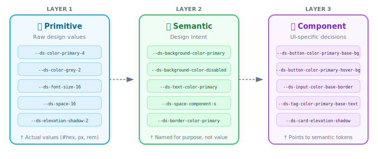
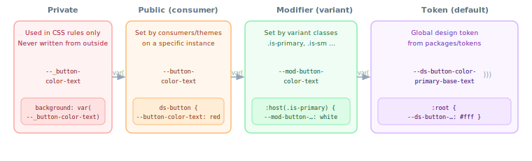

# Design Token Architecture

A guide for UX designers and developers working with the Baloise Design System token system.

---

## What are Design Tokens?

Design tokens are the **named, reusable design decisions** of a system — colors, spacing, typography, shadows — stored as data rather than hard-coded values. Instead of writing `color: #005EFF` everywhere, you write `color: var(--ds-button-color-primary-base-background)`.

This separation means:

- Designers and developers share a **single source of truth**
- Themes and rebrands happen by changing tokens, not hunting through code
- Every component automatically stays consistent

---

## The Three Layers

The token system is organized into three hierarchical layers. Each layer builds on the one below it, moving from raw values toward design intent and finally toward UI-specific decisions.



| Layer | Emoji | Purpose | Example value |
|-------|-------|---------|---------------|
| **Primitive** | 🧱 | The raw palette — every possible value the system can use | `#005EFF`, `16px`, `700` |
| **Semantic** | 🏷️ | What a value *means* — its intended use in the UI | "primary background color" |
| **Component** | 🧩 | What a value does *for a specific component* | "button primary background" |

---

## Layer 1 — Primitive Tokens

Primitives hold every concrete value: color swatches, font sizes, spacing steps, elevation shadows. They have **no opinion about usage** — they are simply a bounded palette.

**Examples from the system:**

| Token | Value |
|-------|-------|
| `--ds-color-primary-4` | `#005EFF` |
| `--ds-color-primary-5` | `#004BD4` |
| `--ds-color-danger-1` | `#FCE8E6` |
| `--ds-color-white` | `#FFFFFF` |
| `--ds-font-size-14` | `0.875rem` |
| `--ds-space-16` | `1rem` |
| `--ds-elevation-shadow-2` | `0 4px 8px rgba(0,7,57,0.14)` |

> Primitives are **never used directly in components**. They exist only so that semantic and component tokens have something concrete to reference.

---

## Layer 2 — Semantic Tokens

Semantic tokens assign meaning. Instead of "primary color at shade 4", a semantic token says "the color to use for a primary background". This is where **design decisions live**.

**Examples from the system:**

| Token | References | Meaning |
|-------|------------|---------|
| `--ds-background-color-primary` | `--ds-color-primary-4` | Primary action surfaces |
| `--ds-background-color-primary-hover` | `--ds-color-primary-5` | Primary surfaces on hover |
| `--ds-background-color-disabled` | `--ds-color-grey-2` | Any disabled surface |
| `--ds-text-color-white` | `--ds-color-white` | Text on dark/colored backgrounds |
| `--ds-border-color-primary` | `--ds-color-primary-4` | Primary borders |
| `--ds-radius-base` | `4px` | Default border radius |

> Semantic tokens are what **UX designers work with** when building themes or making system-wide color decisions.

---

## Layer 3 — Component Tokens

Component tokens map semantic tokens to specific parts of a component. They carry **state variants** (base, hover, active, disabled, focus) and **visual variants** (primary, secondary, ghost).

**Examples from the system — Button:**

| Token | References |
|-------|------------|
| `--ds-button-color-primary-base-background` | `--ds-background-color-primary` |
| `--ds-button-color-primary-hover-background` | `--ds-background-color-primary-hover` |
| `--ds-button-color-primary-active-background` | `--ds-background-color-primary-active` |
| `--ds-button-color-primary-base-text` | `--ds-text-color-white` |
| `--ds-button-color-primary-base-border` | `--ds-border-color-primary` |
| `--ds-button-radius-base` | `--ds-radius-base` |

---

## Example: Button Background Color — Full Chain

Tracing a single decision — the background color of a primary button — all the way from raw hex value to CSS rule:



```
🧱 Primitive          🏷️ Semantic                    🧩 Component
#005EFF  ──────►  --ds-background-color-primary  ──►  --ds-button-color-primary-base-background
```

**Why this matters:** If we need to rebrand the primary blue, we change **one primitive token** and the update cascades through every semantic and component token that references it — automatically, across the entire system.

---

## The CSS Variable Cascade (Component Level)

Inside a Shadow DOM component, each token passes through a four-step local cascade. This gives consumers a safe way to override individual component values without breaking the system defaults.



The SCSS `vars.local` mixin generates this entire chain automatically:

```scss
// What you write:
@include vars.local(button-color-text, var(--ds-button-color-primary-base-text));

// What it produces:
--_button-color-text: var(--button-color-text,
  var(--mod-button-color-text,
    var(--ds-button-color-primary-base-text)));
```

---

## Responsive Tokens

Semantic tokens for typography, spacing, and layout carry **three breakpoint variants**. Each token exists in three static forms and one auto-responsive `-device` form.



### Two ways to use a responsive token

| Form | Token name | Behaviour |
|------|-----------|-----------|
| **Fixed** | `--ds-text-size-3xl-mobile` | Always the mobile value, regardless of viewport |
| **Fixed** | `--ds-text-size-3xl-tablet` | Always the tablet value |
| **Fixed** | `--ds-text-size-3xl-desktop` | Always the desktop value |
| **Device** | `--ds-text-size-3xl-device` | Automatically switches at breakpoints |

**Always prefer `-device` in component code.** The fixed variants exist for edge cases (e.g. a component that should always render at mobile size inside a sidebar).

### How `-device` works

The build emits the mobile value as the default, then overrides with tablet/desktop values inside media queries:

```css
/* Default (mobile-first) */
:root {
  --ds-text-size-3xl-device: var(--ds-font-size-28); /* 1.75rem */
}

/* Tablet */
@media (min-width: 769px) {
  :root {
    --ds-text-size-3xl-device: var(--ds-font-size-40); /* 2.5rem */
  }
}

/* Desktop */
@media (min-width: 1024px) {
  :root {
    --ds-text-size-3xl-device: var(--ds-font-size-40); /* 2.5rem */
  }
}
```

### Token source — defined once, emitted for all three breakpoints

```json
"Size": {
  "3xl": {
    "Mobile":  { "$value": "{Primitive.Font.Size.28}" },
    "Tablet":  { "$value": "{Primitive.Font.Size.40}" },
    "Desktop": { "$value": "{Primitive.Font.Size.40}" }
  }
}
```

---

## Token Naming Guidelines

_Based on [Nathan Curtis — Naming Tokens in Design Systems](https://medium.com/eightshapes-llc/naming-tokens-in-design-systems-9e86c7444676) (EightShapes)_

### Anatomy of a token name

Token names are composed of ordered segments, each narrowing the scope of the decision:


### Segment definitions

| Segment | What it expresses | Our examples |
|---------|-------------------|-------------|
| **Namespace** | System identifier — prevents collisions with other CSS | `ds` |
| **Category / Component** | The visual property type or component name | `color`, `font`, `space`, `button`, `input` |
| **Property** | The attribute within that category | `background`, `text`, `border` |
| **Variant** | Visual alternatives of the same component | `primary`, `secondary`, `ghost` |
| **State** | Interactive condition | `base`, `hover`, `active`, `disabled`, `focus` |
| **Element** | A nested part within a component | `background`, `text`, `border`, `icon` |
| **Scale** | Ordered sizing options | `1`–`6` for colors, `xs`/`sm`/`md`/`lg` for sizes |

### Key rules we follow

**1. Namespace everything**  
All tokens are prefixed `--ds-` so they never clash with third-party CSS or browser properties.

**2. Semantic names describe intent, not value**  
Write `--ds-background-color-primary`, not `--ds-color-blue-500`. The name survives a rebrand; `blue-500` does not.

**3. Primitives describe what they are; semantic/component tokens describe what they do**

```
✅ --ds-color-primary-4          (primitive — what it is)
✅ --ds-background-color-primary  (semantic  — what it does)
✅ --ds-button-color-primary-base-background  (component — where it does it)

❌ --ds-blue                     (too vague)
❌ --ds-button-blue              (value, not intent)
```

**4. States are explicit, never assumed**  
Always include the state even when it is the default (`-base`). Avoids ambiguity when hover/active/disabled variants are added.

```
--ds-button-color-primary-base-background   ✅
--ds-button-color-primary-background        ❌  (which state?)
```

**5. Never skip the semantic layer for components**  
Components always reference semantic tokens, never primitives directly. This preserves the ability to retheme without touching component definitions.

```
🧩 Component → 🏷️ Semantic → 🧱 Primitive   ✅
🧩 Component → 🧱 Primitive                  ❌
```

**6. Promote shared values gradually**  
If a decision applies to three or more components, promote it to a semantic token. Don't create global tokens for decisions that only one component makes.

**7. Avoid "type" and "text" as category names**  
Both create ambiguity in variable names. We use `font` for typography and `text` only for text color properties.

---

## Output Formats

The token build (Style Dictionary) generates five consumable formats from a single source:

| Format | File | Used by |
|--------|------|---------|
| CSS custom properties | `dist/css/base.tokens.css` | Web components, global stylesheet |
| SCSS variables | `dist/scss/base.tokens.scss` | Sass-based builds |
| JavaScript ES6 exports | `dist/js/base.tokens.js` | JS tooling, design tool integrations |
| Flat JSON | `dist/web/base.tokens.json` | Documentation tooling |
| Hierarchical JSON | `dist/docs/base.tokens.json` | Storybook `<TokenOverview />` component |

---

## Summary

```
Figma variables
      │
      ▼
🧱 Primitive  ──►  raw palette (colors, sizes, shadows)
      │
      ▼
🏷️ Semantic   ──►  design decisions (what values mean)
      │
      ▼
🧩 Component  ──►  per-component decisions (where values go)
      │
      ▼
Style Dictionary build
      │
      ├── CSS custom properties (--ds-…)
      ├── SCSS variables
      └── JavaScript exports
```

Every token change in Figma propagates through this pipeline — ensuring the system stays in sync across design and code without manual reconciliation.
